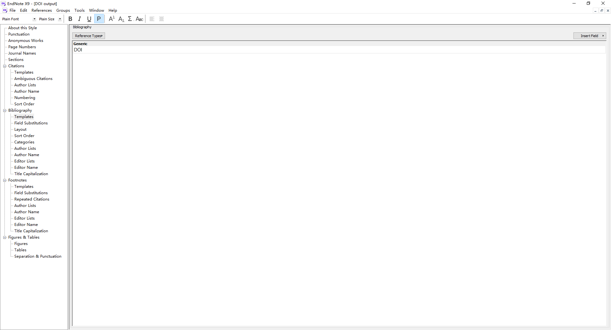
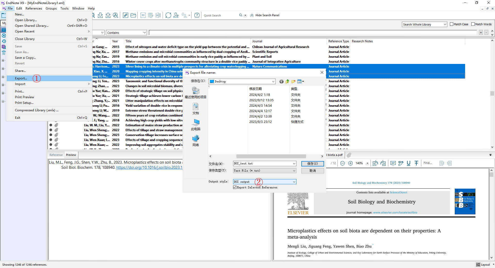
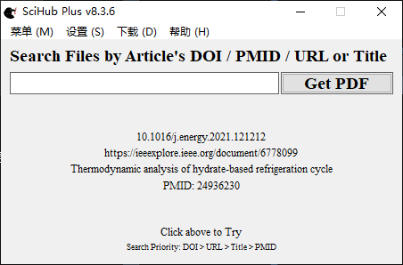

利用文献管理软件 EndNote 将大量文献的 DOI 导出，再利用 Python 或其它方式实现文献的批量下载。

# 利用 EndNote 将文献的 DOI 批量导出

-   文献题录信息向 EndNote 的导入、管理与更新，可参考 [chugit/EndNote_Chinese_Literature 文献管理](https://github.com/chugit/EndNote_Chinese_Literature?tab=readme-ov-file#%E6%96%87%E7%8C%AE%E7%AE%A1%E7%90%86)。要求待下载的文献具有 [DOI](https://www.doi.org/the-identifier/what-is-a-doi/ "WHAT IS A DOI?")。 DOI 可从文献数据库（如 [Crossref](https://search.crossref.org/ "Crossref Metadata Search")、[WOS](https://www.webofscience.com "Web of Science") 等）或文章官方详情页检索获取。

-   自定义文献导出样式，用于文献 DOI 的导出。此处有两种可供选择的方式：一是自行新建导出样式，在 EndNote 中依次点击 Edit - Output Styles - New Style，在 Biblipgraphy - Templates 中的字段里，填入 `DOI` 并保存文件即可（如下图所示）；二是直接下载已建立好的 [*DOI output.ens*](https://github.com/chugit/EndNote_Chinese_Literature/blob/main/Shared/DOI%20output.ens "chugit/EndNote_Chinese_Literature/Shared/DOI output.ens") 文件，放入 EndNote 安装目录的 Styles 文件夹内。

    

-   文献 DOI 的导出。 在 EndNote 中选中待导出的文献，依次点击 File - Export 打开导出文件面板，Output style 选择 *DOI output* 后保存。

    

# 利用 Python 实现文献的批量下载

本方法要求文献 DOI 能够在 Sci-Hub 数据库检索得到。

-   手动设置工作目录并读取 DOI 文档。本文测试用的 [*DOI_test.txt*](DOI_test.txt) 文件已上传至仓库。

```python
import requests
import os
import threading
import concurrent.futures

# 此处应手动设置工作目录
os.chdir("D:\\R\\Markdown\\Batch_Download")

# 自动创建下载目录
download_dir = os.path.join(os.getcwd(), "Download")
if not os.path.exists(download_dir):
    os.makedirs(download_dir)

# 打开DOI_test.txt（文件名称应根据实际修改，并将该文件提前放于工作目录文件夹内）
with open("DOI_test.txt", "r") as file:
    lines = file.readlines()

```

-   全选下方代码并运行，实现文献的批量下载。

```python
headers = {"User-Agent": "Mozilla/5.0 (Windows NT 10.0; Win64; x64) AppleWebKit/537.36 (KHTML, like Gecko) Chrome/80.0.3987.149 Safari/537.36"}

# 初始化统计变量
total_count = len(lines)
success_count = 0
failure_count = 0
not_downloaded_count = total_count

# 创建空表以存储下载失败的DOI
failed_contents = []

# 创建锁对象，用于线程同步
lock = threading.Lock()

# 自定义文献下载函数
def download_file(url, file_name, content):
    response = requests.get(url, headers=headers)

    if response.status_code == 200:
        # 构建文件路径
        file_path = os.path.join(download_dir, file_name)

        with open(file_path, "wb") as file:
            file.write(response.content)

        # 使用锁更新成功下载数
        with lock:
            global success_count
            success_count += 1

        print(f"文件 {file_name} 下载成功！")
    else:
        # 使用锁更新失败下载数并保存失败DOI
        with lock:
            global failure_count
            failure_count += 1
            failed_contents.append(content)

        print(f"文件 {file_name} 下载失败！")

    # 使用锁更新尚未下载数
    with lock:
        global not_downloaded_count
        not_downloaded_count -= 1

    # 下载状态实时提示
    with lock:
        print("======== 下载统计 ========")
        print(f"计划总下载数：{total_count}")
        print(f"已成功下载数：{success_count}")
        print(f"下载失败数：{failure_count}")
        print(f"尚未下载数：{not_downloaded_count}")


# 创建线程列表和线程池，以实现多线程下载
threads = []
max_workers = 10  # 可根据需要调整并发线程数量
thread_pool = concurrent.futures.ThreadPoolExecutor(max_workers=max_workers)

# 逐行处理DOI并下载对应的文献
for line in lines:
    url = "https://sci.bban.top/pdf/" + line.strip() + ".pdf?download=true"

    # 提取DOI号作为文献文件名
    file_name = line.strip().replace("/", "-") + ".pdf"

    # 提交任务给线程池
    future = thread_pool.submit(download_file, url, file_name, line)

    threads.append(future)

# 等待所有任务完成
_ = concurrent.futures.wait(threads)

# 所有线程完成后，将下载失败的文献DOI保存到工作目录下
if failed_contents:
    failed_file = os.path.join(os.getcwd(), "download_failures.txt")
    with open(failed_file, "w") as file:
        for content in failed_contents:
            file.write(content)
    print(f"下载失败的DOI已保存到 {failed_file}")

```

批量下载的文献 PDF 可参考 [chugit/EndNote_Chinese_Literature 导入 PDF 文件](https://github.com/chugit/EndNote_Chinese_Literature?tab=readme-ov-file#%E7%9B%B4%E6%8E%A5%E5%AF%BC%E5%85%A5-pdf-%E6%96%87%E4%BB%B6) 进行管理。

文献下载未成功的，可重复上述过程多下载几次。实在无法下载的，说明 Sci-Hub 数据库暂不包含此文献。可考虑采用其它方式进行文献下载（如利用第三方软件进行文献批量下载）。

# 利用 Python 实现文献的批量下载

利用第三方软件 [SciHub Plus](https://www.scigreat.com/140020.html "SciHub Plus 软件") 批量下载文献。该软件具有多个文献来源数据库：SciHub、Libgen、UnpayWall、Open Access Button 等，可以下载的文献更多，但只是单线程下载，速度慢。



在软件的设置中调整好参数后，依次点击 下载 - 批量下载，将文献 DOI 复制粘贴，点击开始并等待任务完成。
